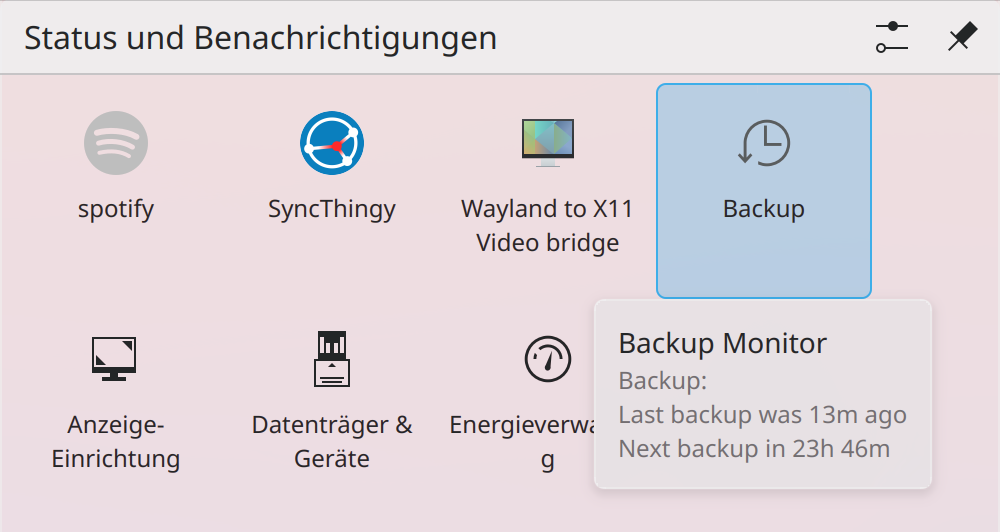

# Backup Monitor

<p align="center">
    
</p>

## About

Backup Monitor is a lightweight tool designed for expert users who need full control over their backup processes. It runs customizable backup scripts according to a user-defined schedule and monitors the status of backup devices. If a device is not mounted, the app waits until it is, ensuring backups only run when the system is ready. A system tray icon provides real-time status updates, showing the next scheduled backup or indicating if a backup is overdue. With its minimal interface and robust functionality, Backup Monitor ensures your backups are timely and reliable without the need for constant oversight.

## Installation

```sh
cargo install --git https://github.com/dfaust/backup-monitor.git
```

## Configuration

The configuration file is located at `~/.config/backup-monitor.yaml`.

### App Settings

- `icon-name` (optional): Name of the system icon for the system tray and notifications.

- `title` (optional): Title for the system tray icon and notifications.

- `scripts` (optional): List of backup scripts (see section below).

- `autostart` (optional): Boolean value indicating whether Backup Monitor should be started with the system.

### Backup Script Settings

- `name`: Name of the backup script used in user messages.

- `icon-name` (optional): Name of the system icon used in the system tray menu.

- `backup-script`: Inline script that will be run to create a backup.

- `backup-path` (optional): Destination path of the backup. This can be a path that is not always available. Backup Monitor will watch the path to appear and be writable before starting backups.

- `interval`: Interval in which backups should be run.

- `reminder` (optional): Duration after which a backup is considered overdue. Backup Monitor will remind the user in that case to run the backup.

- `post-backup-actions` (optional): A list of actions the user may choose to execute after the backup script finished.

  Each post backup action consists of a `label` and a `script`.

- `last-backup` (internal): Used internally by Backup Monitor to track when the last successful backup was run.

### Examples

Simple rsync backup script:

```yaml
scripts:
- name: Backup
  backup-script: |
    #!/usr/bin/env bash
    set -o errexit
    rsync -ah --delete $HOME/ /mnt/backup/home/
  backup-path: /mnt/backup
  interval: 1day
  reminder: 7days
  post-backup-actions:
  - label: Unmount backup HDD
    script: |
      #!/usr/bin/env bash
      set -o errexit
      umount /mnt/backup
autostart: false
```

Multiple backup scripts:

```yaml
scripts:
- name: Home Backup
  backup-script: |
    #!/usr/bin/env bash
    set -o errexit
    rsync -ah --delete $HOME/ /mnt/backup/home/
  backup-path: /mnt/backup
  interval: 1day
  reminder: 7days
- name: System Backup
  backup-script: |
    #!/usr/bin/env bash
    set -o errexit
    rsync -ah --delete /etc/ /mnt/backup/system/
  backup-path: /mnt/backup
  interval: 1day
  reminder: 7days
autostart: false
```

## Usage

Run `backup-monitor`, then right-click the tray icon and select `Settings`.

Edit the config file and save it.

In order to increase logging, set the environment variable `RUST_LOG` to `trace`.
