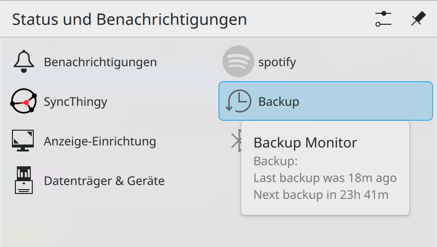

# Backup Monitor

<p align="center">
    
</p>

## About

Backup Monitor is a lightweight tool designed for expert users who need full control over their backup processes. It runs customizable backup scripts according to a user-defined schedule and monitors the status of backup devices. If a device is not mounted, the app waits until it is, ensuring backups only run when the system is ready. A system tray icon provides real-time status updates, showing the next scheduled backup or indicating if a backup is overdue. With its minimal interface and robust functionality, Backup Monitor ensures your backups are timely and reliable without the need for constant oversight.

## Installation

### From Source

```sh
cargo install --git https://github.com/dfaust/backup-monitor.git
```

### Pre-Built Binary

```sh
curl -s https://api.github.com/repos/dfaust/backup-monitor/releases/latest | grep browser_download_url | cut -d '"' -f 4 | grep -E "unknown-linux-musl\.zip$" | xargs curl -L > backup-monitor.zip
unzip -d backup-monitor backup-monitor.zip
```

## Usage

1. Start the application by running `backup-monitor`.
2. A system tray icon will appear, showing the current backup status.
3. Right-click the tray icon to:
   - Access settings
   - Run backups manually
   - Quit the application
4. Edit the config file and save it.
5. Hover the tray icon to:
   - View backup status and next scheduled time

In order to increase logging, set the environment variable `RUST_LOG` to `trace` (the default is `debug`).

## Configuration

The configuration file is located at `~/.config/backup-monitor.yaml`. You can edit it manually or through the Settings dialog accessible from the system tray icon.

### App Settings

- `icon-name` (optional): Name of the system icon for the system tray and notifications. Defaults to "backup".

- `title` (optional): Title for the system tray icon and notifications. Defaults to "Backup Monitor".

- `scripts` (optional): List of backup scripts (see section below).

- `autostart` (optional): Boolean value indicating whether Backup Monitor should be started with the system. Defaults to "false".

### Backup Script Settings

- `name`: Name of the backup script used in user messages and the system tray menu.

- `icon-name` (optional): Name of the system icon used in the system tray menu. Defaults to "system-run".

- `backup-script`: Inline script that will be run to create a backup.

  - Scripts should start with a shebang (e. g. `#!/usr/bin/bash`). If they don't, `/usr/bin/sh` will be used.
  - All lines written by the script to either stdout or stderr that start with `ui: ` will be displayed to the user (with the prefix stripped).

- `mount-paths` (optional): Paths that must be mounted before the backup can be run. Backup Monitor will watch these paths and wait for them to be mounted before starting backups.

- `interval`: Interval in which backups should be run. Supports units: minutes, hours, days, weeks (e.g., "30minutes", "12hours", "1week").

- `reminder` (optional): Duration after which a backup is considered overdue. When overdue, the tray icon becomes active and notifications are shown. Uses the same time units as `interval`.

- `post-backup-actions` (optional): A list of actions the user may choose to execute after the backup script finished.

  Each post backup action consists of a `label` and a `script`. For each action a button is shown with the given label. The script works the same way as `backup-script`.

- `last-backup` (internal): Used internally by Backup Monitor to track when the last successful backup was run.

### Examples

Simple rsync backup script:

```yaml
scripts:
- name: Backup
  backup-script: |
    #!/usr/bin/bash
    set -o errexit
    rsync -ah --delete $HOME/ /mnt/backup/home/
  mount-paths: ["/mnt/backup"]
  interval: 1day
  reminder: 7days
  post-backup-actions:
  - label: Unmount backup HDD
    script: |
      #!/usr/bin/bash
      set -o errexit
      umount /mnt/backup
autostart: false
```

Multiple backup scripts:

```yaml
scripts:
- name: Home Backup
  backup-script: |
    #!/usr/bin/bash
    set -o errexit
    rsync -ah --delete $HOME/ /mnt/backup/home/
  mount-paths: ["/mnt/backup"]
  interval: 1day
  reminder: 7days
- name: System Backup
  backup-script: |
    #!/usr/bin/bash
    set -o errexit
    rsync -ah --delete /etc/ /mnt/backup/system/
  mount-paths: ["/mnt/backup"]
  interval: 1day
  reminder: 7days
autostart: false
```
